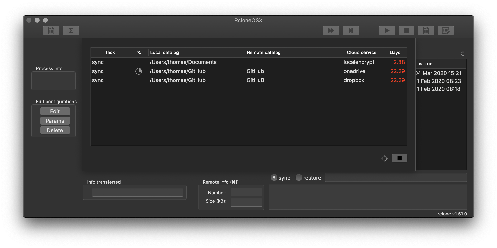
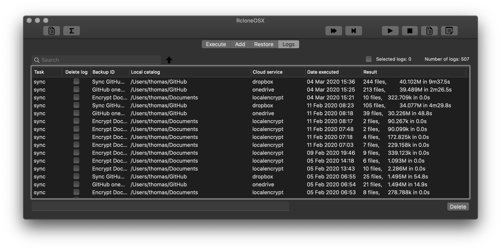

## RcloneOSX

[Please read the Changelog](https://rsyncosx.github.io/RcloneChangelog).

The project is a adapting [RsyncOSX](https://github.com/rsyncOSX/RsyncOSX) utilizing [rclone](https://rclone.org/) for **synchronizing** and **backup** of files to a number of cloud services. RcloneOSX utilizes `rclone copy`, `sync`, `move` and `check` commands.

RcloneOSX is compiled with support for **macOS El Capitan version 10.11 - macOS Catalina 10.15**. The application is implemented in pure Swift 5 (Cocoa and Foundation).

RcloneOSX require the `rclone` command line utility to be installed. If installed in other directory than `/usr/local/bin`, please change directory by user configuration in RcloneOSX. RcloneOSX checks if there is a rclone installed in the provided directory. To use RcloneOSX require utilize rclone to setup and add configurations.

Rclone is *rsync for cloud storage*. Even if `rclone` and `rsync` are somewhat equal they are also very different. RcloneOSX is built upon the ideas from [RsyncOSX](https://github.com/rsyncOSX/RsyncOSX). It is not possible to clone all functions in RsyncOSX to RcloneOSX. I spend most of my time developing [RsyncOSX](https://github.com/rsyncOSX/RsyncOSX). From time to time some functions are ported to RcloneOSX from RsyncOSX.

I am not an advanced user of `rclone` and my use of RcloneOSX is **synchronizing** my GitHub catalogs to Dropbox and OneNote for test. Rclone has lot more functions than just synchronizing data. There are no plans to implement more functions into RcloneOSX.

### Where to start utilizing RcloneOSX

To start utilizing RcloneOSX first of all add configurations by command line `rclone config`. When RcloneOSX starts it pick up configurations added by rclone. Rclone configurations must be stored in standard configuration catalog e.g. `/Users/thomas/.config/rclone` and **not** encrypted.

After adding configurations start RcloneOSX and go to Add tab. Add catalogs and you are ready for synchronizing.

### About bugs

Fighting bugs are difficult. I am not able to test RcloneOSX for all possible user interactions and use. From time to time I discover new bugs. But I also need support from other users discovering bugs or not expected results. If you discover a bug please use the [issues](https://github.com/rsyncOSX/rcloneosx/issues) and report it.

### Application icon

The application icon is created by [Zsolt Sándor](https://github.com/graphis). All rights reserved to Zsolt Sándor.

### Signing and notarizing

The app is signed with my Apple ID developer certificate and [notarized](https://support.apple.com/en-us/HT202491) by Apple. See [signing and notarizing](https://rsyncosx.github.io/Notarized) for info. Signing and notarizing is required to run on macOS Catalina.

### Main view

The main view of RcloneOSX.

Estimation of task for sync completed.

Sync of task in action.

Logs.

### Compile

To compile the code, install Xcode and open the RcloneOSX project file. Before compiling, open in Xcode the `RcloneOSX/General` preference page (after opening the RcloneOSX project file) and replace your own credentials in `Signing`, or disable Signing.

There are two ways to compile, either utilize `make` or compile by Xcode. `make release` will compile the `rcloneosx.app` and `make dmg` will make a dmg file to be released.  The build of dmg files are by utilizing [andreyvit](https://github.com/andreyvit/create-dmg) script for creating dmg and [syncthing-macos](https://github.com/syncthing/syncthing-macos) setup.
